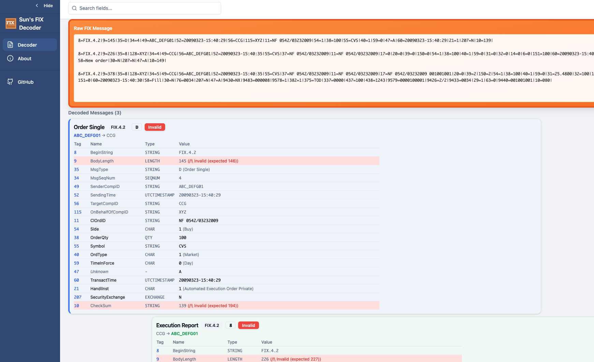

# Sun's FIX Decoder

**A straightforward, client-side FIX message parser.**

If you work with FIX execution reports or logs every day, you just need a tool that works. This is a simple, modern fork of the original fix-decoder that makes reading raw FIX logs a lot easier on the eyes.



## What is this?

It's a web tool that takes raw FIX strings and turns them into readable tables.

I built this fork because I needed a few things that weren't in the original:
*   **Better UI**: A cleaner interface that doesn't hurt to look at all day.
*   **In-place Search**: Search any FIX tag or value using the Search bar on decoder page, results are shown in real-time with highlight.
*   **Custom Tags**: We all deal with custom venue tags. You can add them right in the browser so they show up with proper names instead of just numbers.
*   **More delimiters supported**: Different FIX engines use different delimiters, this tool supports 6 different delimiters. 


| Delimiter     | Description                  | Status |
|---------------|------------------------------|--------|
| \x01 / \u0001 | SOH (official FIX delimiter) | ✅     |
| \|            | Pipe                         | ✅     |
| ;             | Semicolon                    | ✅     |
| ^             | Caret                        | ✅     |
| ^A            | Text representation of SOH   | ✅     |
| \t            | Tab                          | ✅     |


## Key Features

*   **Privacy First**: Everything runs in your browser. Paste your FIX logs, and they stay on your machine. Nothing gets sent to a server.
*   **Fast**: It handles large blocks of text without freezing up.
*   **Validation**: It checks checksums for you, so you know if a message is corrupted.
*   **Dark Mode**: More people prefer dark mode while I don't use it personally, please try and share your feedback.

## Use It Now

Go here: [https://sunotech.github.io/fix-decoder/](https://sunotech.github.io/fix-decoder/)

## Running Locally

If you prefer to run it on your own machine (or need it offline):

1.  Clone it:
    ```bash
    git clone https://github.com/sunotech/fix-decoder.git
    cd fix-decoder
    ```

2.  Install & Run:
    ```bash
    npm install
    npm run dev
    ```

That's it.

## License

This program is free software: you can redistribute it and/or modify
it under the terms of the GNU General Public License as published by
the Free Software Foundation, either version 3 of the License, or
(at your option) any later version.

This program is distributed in the hope that it will be useful,
but WITHOUT ANY WARRANTY; without even the implied warranty of
MERCHANTABILITY or FITNESS FOR A PARTICULAR PURPOSE.  See the
GNU General Public License for more details.

You should have received a copy of the GNU General Public License
along with this program.  If not, see <http://www.gnu.org/licenses/>.
